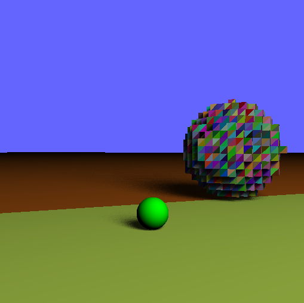
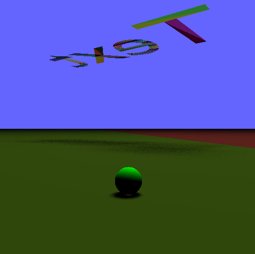

# The Krov Engine

## What is this?
The Krov Engine is a GPU-accelerated raytracing engine made in C++ with love by Saalty, a friend of mine. His github account is @waternine9\. All credit goes to him.

## What does it do?
The Krov Engine can support:
- Real-time rendering
- Raytracing
- Soft & hard shadows
- `.obj` file support
- Simple physics
- Dynamic cameras with collision detection

## What does it require?
The Krov Engine requires 3 libraries pre-installed
- GLM
- OpenCV
- CUDA

**Note**: Since this program requires CUDA, an Nvidia product, you must also have an Nvidia graphics card, preferably GTX 1650 or better.

## How do I install it?
Simple (kind of)! Just create a C++ CUDA project, preferably using Visual Studio 2019, add the files and folders in this github repo to the project, and install the libraries mentioned above!

## The default scene
This scene will likely change, as it is just the current scene Saalty is working on. Here are the controls for the current one:
| Key(s) | Use |
| - | - |
| `W` | Move forward |
| `S` | Move backward |
| `A` | Turn left |
| `D` | Turn right |
| `Q` | Zoom into player |
| `E` | Zoom out of player |
| `F` & `G` | Move the light source's X position |
| `H` & `J` | Move the light source's Y position |
| `K` & `L` | Move the light source's Z position |

## Example Pictures

---

This is Saalty's hobby, and along with AI, this is his favorite topic of computer science. I may pitch in occasionally, but most of this work is completely his. Hope you have fun with it!
